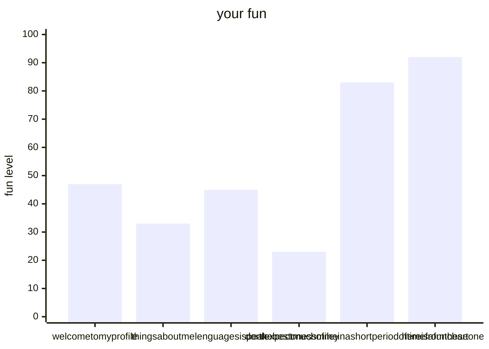

# welcome to my profile
## things about me
i am profesional programer (fake news by the way)

## lenguages i speak

  
  
lenguages i speak

  
#### the best ones :)
1. [english](https://www.oed.com/?tl=true)
2. [javascript (links to ecmascript)](https://ecma-international.org/publications-and-standards/standards/ecma-262/)
3. [python](https://www.python.org)
4. [Github Markdown](https://docs.github.com/en/get-started/writing-on-github/getting-started-with-writing-and-formatting-on-github/basic-writing-and-formatting-syntax)
5. [html](https://www.w3.org/html/)/[css](https://www.w3.org/Style/CSS/)
#### dont expect much of me (in a short period of time) from these ones!!
1. c
2. [c++](https://cplusplus.com)
3. [DM (Build your own net dream's)](https://www.byond.com/?)
4. [java](https://www.java.com/en/)

## fun chart

  
 here is a fun chart

  

## what are you doing
secret game nobody knows [Hehhehehee](https://github.com/Hehhehehee/)

